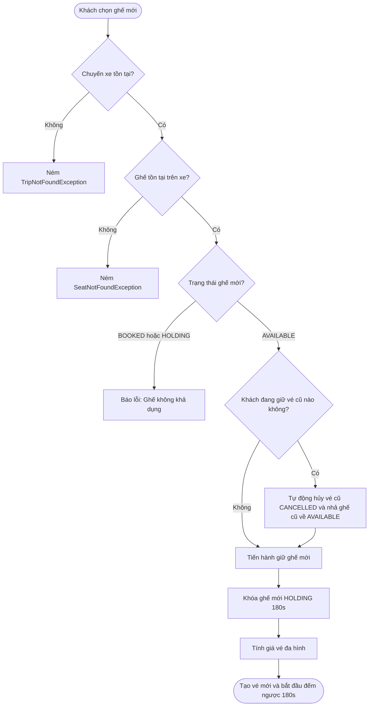

# Flowchart Đặt và Giữ chỗ 3 phút

```mermaid
flowchart TD
    Start(["Khách chọn ghế mới"]) --> CheckTrip{"Chuyến xe tồn tại?"}
    CheckTrip -->|Không| Err1["Ném TripNotFoundException"]
    CheckTrip -->|Có| CheckSeat{"Ghế tồn tại trên xe?"}
    CheckSeat -->|Không| Err2["Ném SeatNotFoundException"]
    CheckSeat -->|Có| CheckStatus{"Trạng thái ghế mới?"}
    CheckStatus -->|BOOKED hoặc HOLDING| Err3["Báo lỗi: Ghế không khả dụng"]
    
    CheckStatus -->|AVAILABLE| CheckOldHold{"Khách đang giữ vé cũ nào không?"}
    CheckOldHold -->|Có| CancelOld["Tự động hủy vé cũ CANCELLED và nhả ghế cũ về AVAILABLE"]
    CheckOldHold -->|Không| HoldNew["Tiến hành giữ ghế mới"]
    CancelOld --> HoldNew
    
    HoldNew --> LockSeat["Khóa ghế mới HOLDING 180s"]
    LockSeat --> CalcPrice["Tính giá vé đa hình"]
    CalcPrice --> Success(["Tạo vé mới và bắt đầu đếm ngược 180s"])
```