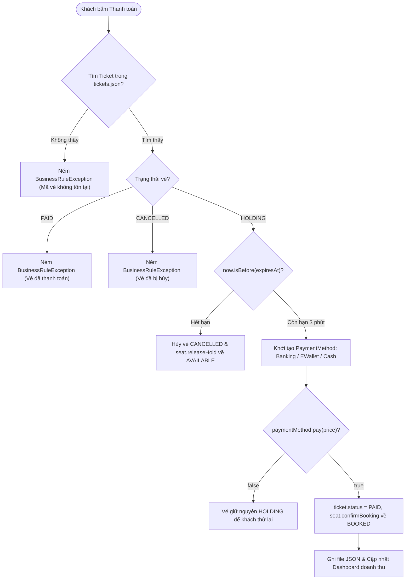

# Flowchart Xử lý Thanh toán (Khớp PaymentMethod Strategy)

```mermaid
flowchart TD
    Start(["Khách bấm Thanh toán"]) --> FindTicket{"Tìm Ticket trong tickets.json?"}
    FindTicket -->|Không thấy| Err1["Ném BusinessRuleException (Mã vé không tồn tại)"]
    FindTicket -->|Tìm thấy| CheckState{"Trạng thái vé?"}
    CheckState -->|PAID| Err2["Ném BusinessRuleException (Vé đã thanh toán)"]
    CheckState -->|CANCELLED| Err3["Ném BusinessRuleException (Vé đã bị hủy)"]
    CheckState -->|HOLDING| CheckTimeout{"now.isBefore(expiresAt)?"}
    CheckTimeout -->|Hết hạn| Expired["Hủy vé CANCELLED & seat.releaseHold về AVAILABLE"]
    CheckTimeout -->|Còn hạn 3 phút| ExecPay["Khởi tạo PaymentMethod: Banking / EWallet / Cash"]
    ExecPay --> PayResult{"paymentMethod.pay(price)?"}
    PayResult -->|false| Retry["Vé giữ nguyên HOLDING để khách thử lại"]
    PayResult -->|true| Success["ticket.status = PAID, seat.confirmBooking về BOOKED"]
    Success --> SaveData["Ghi file JSON & Cập nhật Dashboard doanh thu"]
```