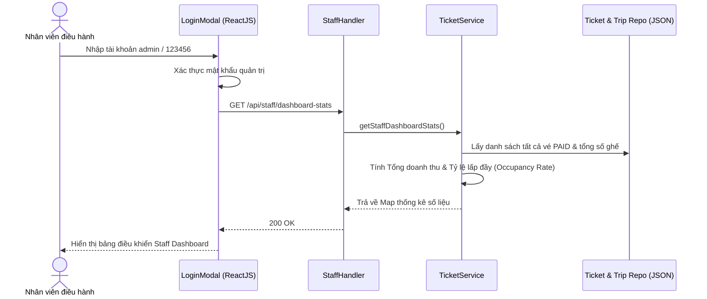

# Sơ đồ Tuần tự Đăng nhập Quản trị và Tổng hợp Doanh thu

```mermaid
sequenceDiagram
    actor Staff as Nhân viên điều hành
    participant UI as LoginModal (ReactJS)
    participant Handler as StaffHandler
    participant Service as TicketService
    participant Repo as Ticket & Trip Repo (JSON)

    Staff->>UI: Nhập tài khoản admin / 123456
    UI->>UI: Xác thực mật khẩu quản trị
    UI->>Handler: GET /api/staff/dashboard-stats
    Handler->>Service: getStaffDashboardStats()
    Service->>Repo: Lấy danh sách tất cả vé PAID & tổng số ghế
    Service->>Service: Tính Tổng doanh thu & Tỷ lệ lấp đầy (Occupancy Rate)
    Service-->>Handler: Trả về Map thống kê số liệu
    Handler-->>UI: 200 OK
    UI-->>Staff: Hiển thị bảng điều khiển Staff Dashboard
```