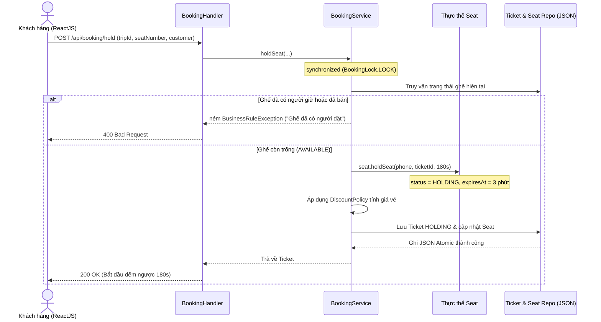

# Sơ đồ Tuần tự Đặt và Giữ chỗ 3 phút

```mermaid
sequenceDiagram
    actor Khach as Khách hàng (ReactJS)
    participant Handler as BookingHandler
    participant Service as BookingService
    participant Seat as Thực thể Seat
    participant Repo as Ticket & Seat Repo (JSON)

    Khach->>Handler: POST /api/booking/hold (tripId, seatNumber, customer)
    Handler->>Service: holdSeat(...)
    Note over Service: synchronized (BookingLock.LOCK)
    Service->>Repo: Truy vấn trạng thái ghế hiện tại
    alt Ghế đã có người giữ hoặc đã bán
        Service-->>Handler: ném BusinessRuleException ("Ghế đã có người đặt")
        Handler-->>Khach: 400 Bad Request
    else Ghế còn trống (AVAILABLE)
        Service->>Seat: seat.holdSeat(phone, ticketId, 180s)
        Note over Seat: status = HOLDING, expiresAt = 3 phút
        Service->>Service: Áp dụng DiscountPolicy tính giá vé
        Service->>Repo: Lưu Ticket HOLDING & cập nhật Seat
        Repo-->>Service: Ghi JSON Atomic thành công
        Service-->>Handler: Trả về Ticket
        Handler-->>Khach: 200 OK (Bắt đầu đếm ngược 180s)
    end
```