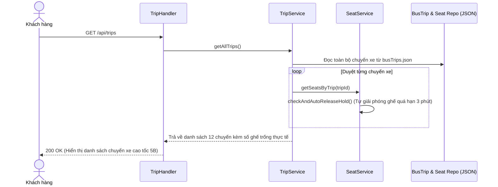

# Sơ đồ Tuần tự Tra cứu Chuyến xe và Quét ghế trống

```mermaid
sequenceDiagram
    actor Khach as Khách hàng
    participant Handler as TripHandler
    participant Service as TripService
    participant SeatService as SeatService
    participant Repo as BusTrip & Seat Repo (JSON)

    Khach->>Handler: GET /api/trips
    Handler->>Service: getAllTrips()
    Service->>Repo: Đọc toàn bộ chuyến xe từ busTrips.json
    loop Duyệt từng chuyến xe
        Service->>SeatService: getSeatsByTrip(tripId)
        SeatService->>SeatService: checkAndAutoReleaseHold() (Tự giải phóng ghế quá hạn 3 phút)
    end
    Service-->>Handler: Trả về danh sách 12 chuyến kèm số ghế trống thực tế
    Handler-->>Khach: 200 OK (Hiển thị danh sách chuyến xe cao tốc 5B)
```