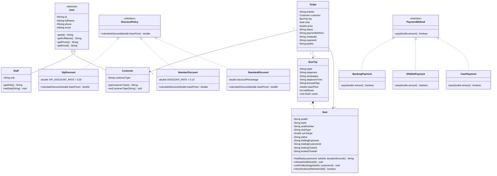

# Sơ đồ Lớp Hệ thống (Khớp chính xác 100% mã nguồn Java)

```mermaid
classDiagram
    %% KẾ THỪA TỪ USER.JAVA
    class User {
        <<abstract>>
        #String id
        #String fullName
        #String phone
        #String email
        +getId() String
        +getFullName() String
        +getPhone() String
        +getEmail() String
    }
    class Customer {
        -String customerType
        +getCustomerType() String
        +setCustomerType(String) void
    }
    class Staff {
        -String role
        +getRole() String
        +setRole(String) void
    }
    User <|-- Customer
    User <|-- Staff

    %% ĐA HÌNH DISCOUNT POLICY (STRATEGY PATTERN)
    class DiscountPolicy {
        <<interface>>
        +calculateDiscount(double basePrice) double
    }
    class VipDiscount {
        -double VIP_DISCOUNT_RATE = 0.20
        +calculateDiscount(double basePrice) double
    }
    class MemberDiscount {
        -double DISCOUNT_RATE = 0.10
        +calculateDiscount(double basePrice) double
    }
    class StandardDiscount {
        -double discountPercentage
        +calculateDiscount(double basePrice) double
    }
    DiscountPolicy <|.. VipDiscount
    DiscountPolicy <|.. MemberDiscount
    DiscountPolicy <|.. StandardDiscount

    %% ĐA HÌNH PAYMENT METHOD (STRATEGY PATTERN)
    class PaymentMethod {
        <<interface>>
        +pay(double amount) boolean
    }
    class BankingPayment {
        +pay(double amount) boolean
    }
    class EWalletPayment {
        +pay(double amount) boolean
    }
    class CashPayment {
        +pay(double amount) boolean
    }
    PaymentMethod <|.. BankingPayment
    PaymentMethod <|.. EWalletPayment
    PaymentMethod <|.. CashPayment

    %% DOMAIN MODELS
    class BusTrip {
        -String tripId
        -String departure
        -String destination
        -String departureTime
        -String licensePlate
        -double basePrice
        -int totalSeats
        -List~Seat~ seats
    }
    class Seat {
        -String seatId
        -String tripId
        -String seatNumber
        -String seatType
        -double surcharge
        -String status
        -String holdingExpiresAt
        -String holdingCustomerId
        -String holdingTicketId
        -String bookedTicketId
        +holdSeat(customerId, ticketId, durationSeconds) String
        +releaseHold(ticketId) void
        +confirmBooking(ticketId, customerId) void
        +checkAndAutoReleaseHold() boolean
    }
    class Ticket {
        -String ticketId
        -Customer customer
        -BusTrip trip
        -Seat seat
        -double price
        -String status
        -String paymentMethod
        -String createdAt
        -String expiresAt
        -String paidAt
    }

    Ticket "1" --> "1" Customer
    Ticket "1" --> "1" BusTrip
    Ticket "1" --> "1" Seat
    BusTrip "1" *-- "*" Seat
```