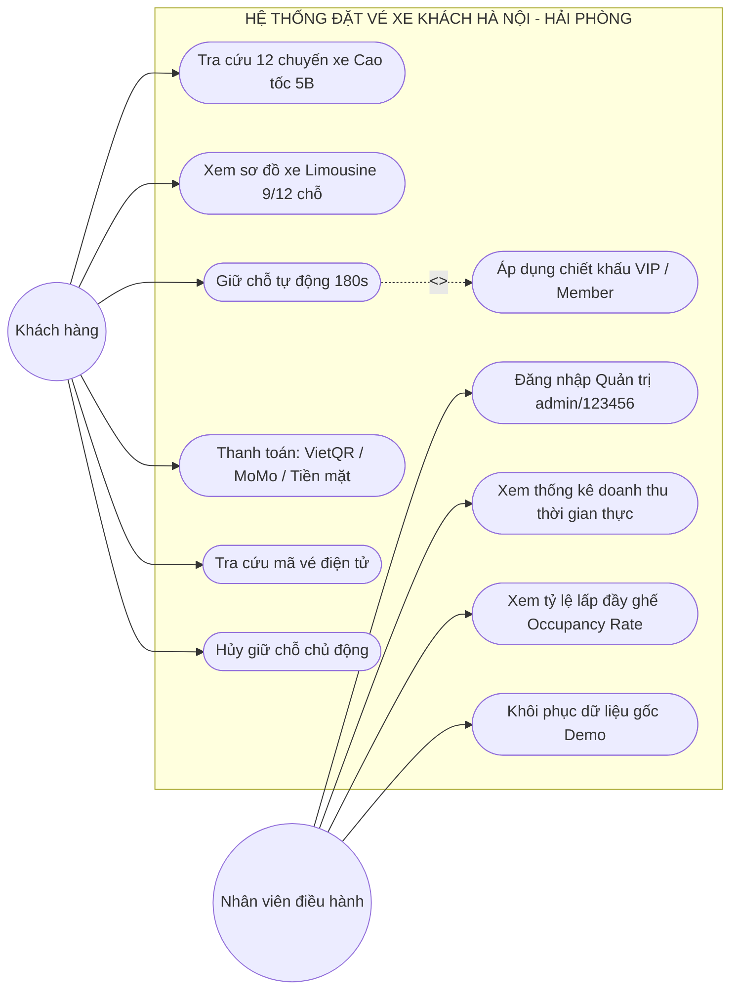

# Sơ đồ Ca sử dụng Tổng thể (Use Case Diagram)

```mermaid
flowchart LR
    Customer((Khách hàng))
    Staff((Nhân viên điều hành))
    subgraph System [HỆ THỐNG ĐẶT VÉ XE KHÁCH HÀ NỘI - HẢI PHÒNG]
        UC1(["Tra cứu 12 chuyến xe Cao tốc 5B"])
        UC2(["Xem sơ đồ xe Limousine 9/12 chỗ"])
        UC3(["Giữ chỗ tự động 180s"])
        UC4(["Áp dụng chiết khấu VIP / Member"])
        UC5(["Thanh toán: VietQR / MoMo / Tiền mặt"])
        UC6(["Tra cứu mã vé điện tử"])
        UC7(["Hủy giữ chỗ chủ động"])
        UC8(["Đăng nhập Quản trị admin/123456"])
        UC9(["Xem thống kê doanh thu thời gian thực"])
        UC10(["Xem tỷ lệ lấp đầy ghế Occupancy Rate"])
        UC11(["Khôi phục dữ liệu gốc Demo"])
    end
    Customer --> UC1
    Customer --> UC2
    Customer --> UC3
    UC3 -.->|<<include>>| UC4
    Customer --> UC5
    Customer --> UC6
    Customer --> UC7
    Staff --> UC8
    Staff --> UC9
    Staff --> UC10
    Staff --> UC11
```